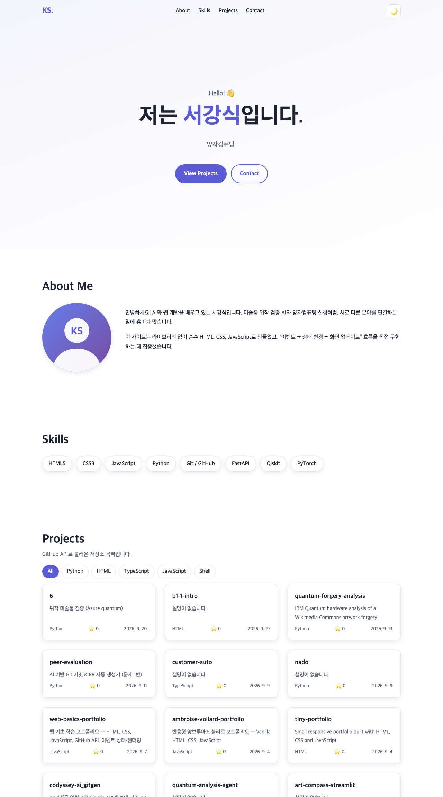
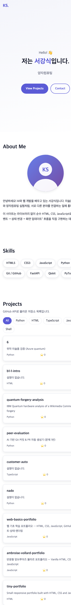
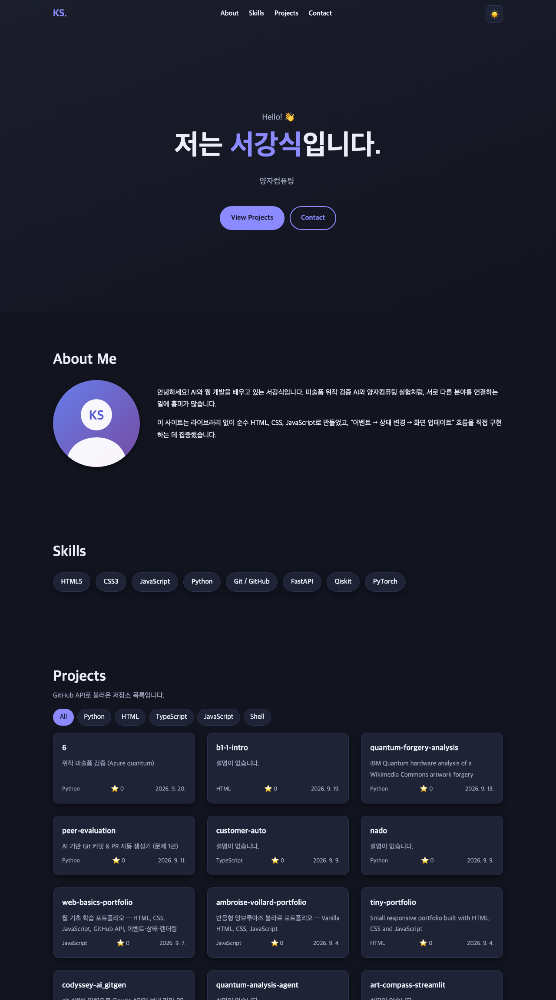

# 서강식 포트폴리오 (B1-1)

순수 HTML / CSS / JavaScript만으로 만든 반응형 포트폴리오 웹사이트입니다. (외부 라이브러리 없음)

- **배포 URL:** https://kangsik-seo.github.io/b1-1-intro/
- **저장소:** https://github.com/KANGSIK-SEO/b1-1-intro

## 사용 기술
HTML5 (시맨틱 태그) · CSS3 (변수, Flexbox, Grid, 미디어쿼리) · JavaScript ES6+ (fetch/async-await, IntersectionObserver, localStorage) · GitHub API · GitHub Pages

## 폴더 구조
```
index.html      메인 페이지
css/style.css   스타일 (CSS 변수, 다크 모드 [data-theme="dark"])
js/main.js      동작 (defer로 연결)
images/         이미지
screenshots/    결과 스크린샷
```

## 기능
- Hero / About / Skills / Projects / Contact / Footer 섹션, 앵커 네비게이션
- 반응형 (모바일 퍼스트, 768px 태블릿 · 1024px 데스크톱), 모바일 햄버거 메뉴
- 다크 모드 토글 (localStorage 저장, 저장값이 없으면 시스템 설정 `prefers-color-scheme` 따름)
- 부드러운 스크롤, 스크롤 탑 버튼, 스크롤 애니메이션, 히어로 타이핑 효과
- GitHub API로 저장소 목록 렌더링: 로딩 / 성공 / 에러(재시도 버튼, 403 레이트 리밋 안내) / 빈 상태, 언어별 필터
- Contact 폼 검증 (필수값, 이메일 형식, 메시지 10자 이상, 필드 옆 에러 메시지, 성공 메시지 — 실제 발송은 하지 않는 데모)

## 설정 기준값 (js/main.js 상단)
| 항목 | 값 |
|---|---|
| 네비게이션 배경 변경 | 스크롤 60px 이상 |
| 스크롤 탑 버튼 표시 | 스크롤 300px 이상 |
| Intersection Observer threshold | 0.2 |

## 이벤트 → 상태 → 렌더링 흐름
1. **다크 모드:** 토글 클릭 → `themeState.current` 변경 → `renderTheme()` 이 `data-theme` 갱신
2. **Projects:** 페이지 로드/재시도 클릭 → `projectsState.status` (loading/success/error/empty) → `renderProjects()`
3. **폼:** input/submit → `formState.errors` → `renderFieldError()` 로 에러 표시/숨김
4. **필터:** 필터 버튼 클릭 → `projectsState.filter` → `renderProjects()`

## 스크린샷
| 데스크톱 | 모바일 | 다크 모드 |
|---|---|---|
|  |  |  |

## 로컬 실행
VS Code에서 폴더를 열고 Live Server로 `index.html` 실행.
